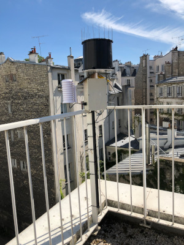

# MeteoLog: an Autonomous NON connected Meteorologic Station using Arduino

* [Introduction](##introduction)
* [Station](##station)
* [Arduino scripts](##arduino-scripts)
* [Python and SQL](##python-and-sql)

## Introduction

The project aims at developping a lowcost meteorologic station with the following properties
* The station's main purpose is to measure rainfall but temperature and humidity are also included,
* it has to be solar powered,
* it has to store the data on an SD card

Included are the references needed to build the station, the electronic and the codes needed to have it run.

## The station

### Structure

* Watchdog auger pluviometer that sends a small voltage when the auger tilts. This one is expensive (400€) because when I bought it it also included an electronic logger that I do not wish to use here because (1) its time resolution is too limited (2) it is not solar powered (3) it uses some silly expensive (100€) windows program to retrieve the data. You can get the equivalent without the logger for ~ 100€ (Rainwise for exemple)
* Temperature and humidity sensor DHT11 (3.5€)
* 3W Solar panel (19€)
* 3.7V, 800mA LiPo battery (7.1€)
* Housing for DHT11 by TFA Dostman (18€)
* Box for the electronic
* Rod and Norcan to hold everything

### Electronic
* Arduino Nano
* RTC module to keep track of time
* The auger pluviometer is connected to the digital port 2 that enables interruptions to be raised.
* SDcard module to store the data

## Arduino scripts

### NanoWeatherLoggerSleepOne

This scripts puts the arduino in deepsleep for a minute. During the sleep period if the auger tilts an interrupt is launched and a rainfall counter increments. At the end of th period the DHT11 measures temperature and humidity and the Arduino stores Temperature, humidity and amount of rain fallen during the last minute.

A sample of a METEOLOG.TXT data file stored on the SD card is given in data.

## Python and SQL

I use a Mariadb database to store the data once retrieved from the SDcard. I call the base weatherDB.

The format of the data table corresponding to the NanoWeatherLoggerSleepOne script is given below.

* stcode, int, station code
* md, date, date of measurement
* mt, time, time of measurement
* T, float, temperature
* H, float, Humidity
* P, float, precipitation

The stations table records the Station informations so it becomes possible to store the data from as many stations as we wish (once they're built !)

its structure is the following

* stcode, int, station code
* name, varchar(255), station name,
* longitude, float
* latitude, float
* elevation, float
* comment, text, any useful information.

A sample of the database is given in data.
